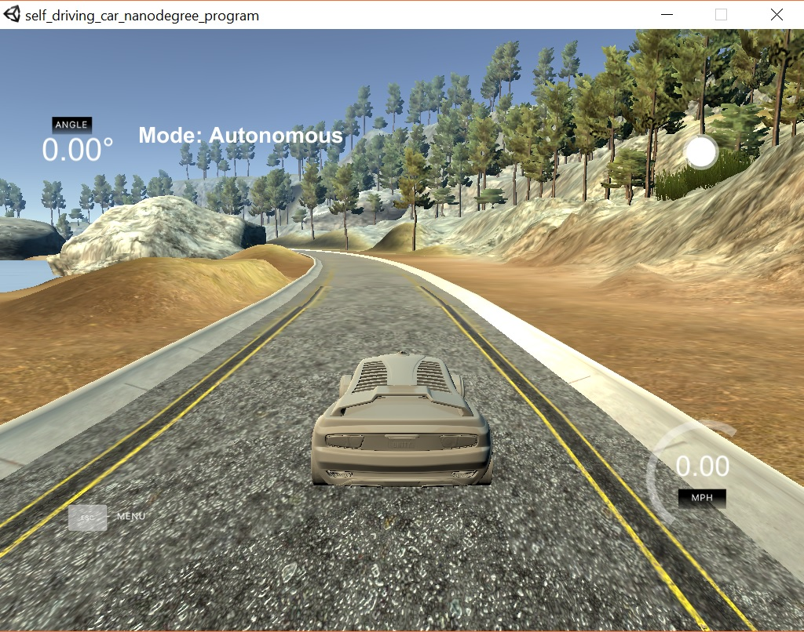

# CarND-Controls-PID
Self-Driving Car Engineer Nanodegree Program

---

## My Take on this Project

Much as I like Sebastian Thrun, his Twiddle doeasn't like me. I ended up tweaking the parameters manually. And it only took me half a day. Unlike the "Twiddle" where I never gotten anywhere in the 2 days I worked on it. All in all, there are some advantages on manually tweaking the parameters:

1. I got to sense how the errors cycle through as you go along the path.
2. I got to sense how big or small are the effects of the errors.

The best paper that suggests an insightful way to tweak the PID parameters manually is from (George Gillard, An Introduction and Tutorial for PID Controllers )[http://smithcsrobot.weebly.com/uploads/6/0/9/5/60954939/pid_control_document.pdf]. I'm sure there tons of papers out there on PID and other controllers but this one helped me a lot for my project and is a good 5 minutes read to complement the awesome SDCND classroom videos.

As for the parameters, here are a few suggestions to add:
1. It is best to start with all parameters at 0. 
2. It is best to start with adjusting only the Kp, the proportional coefficient.
3. Depending on the throttle, I'd say the best Kp values ~ 0.4 - 0.6 (speed ~ 20mph).  
4. It is best to start at a low throttle (0.2 worked fine for me).
5. You'd know you have chosen a good Kp when your car stays on the road and reaches the finish line despite the oscillation.
6. Between Kd, the differential coefficient and Ki, the integral coefficient, it it best to adjust the Kd before the Ki.
7. The Kd should have a bigger value ~ 3 - 5. 
8. The Ki should have a lower effect, therefore lower value. Testing in the magnitude of 10s works best, starting at 0.1.
9. The signs of the coefficients play a very important role that can often be overlooked. How you write your formula should determine what the signs of your coefficients are.
10. Enjoy! Don't overdo it. PID is time-consuming. I'd still want to be tweaking with the Twiddle but some other time perhaps. Not when you have a deadline for a project to meet.

